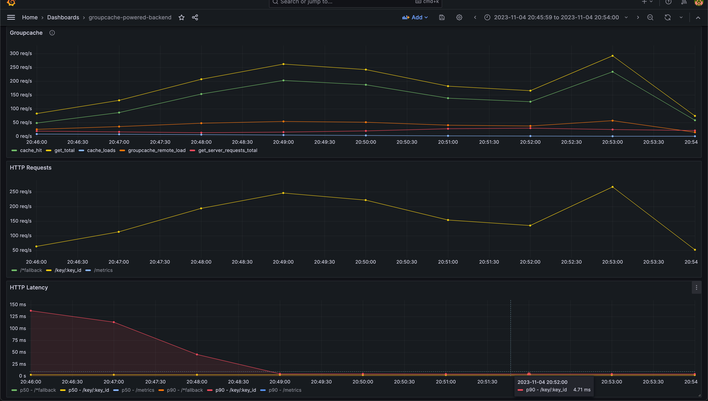

# kubernetes-service-discovery example

This example shows how to run a simple backend with groupcache with multiple instances on k8s.
- simple endpoint is implemented `/key/:key_id` that loads a value for :key_id from groupcache,
  which mimics a fetch from database lasting 100ms.
- kubernetes API server is used for service discovery.
- backend is written using axum framework,
  exposing both application HTTP/JSON endpoints and groupcache gRPC endpoint on the same port.

## Running example on minikube

Make sure all dependencies are installed and running [see Dependencies](#dependencies).

Deploy groupcache-powered-backend with a couple of instances:
```bash
kubectl apply -f k8s/groupcache-powered-backend/role.yaml
kubectl apply -f k8s/groupcache-powered-backend/role-binding.yaml
kubectl apply -f k8s/groupcache-powered-backend/deployment.yaml
kubectl apply -f k8s/groupcache-powered-backend/service.yaml
```

To view logs from the backends we just deployed run:
```bash
kubectl logs -l app=groupcache-powered-backend -f
```

So far they're not doing anything interesting, but we can run a small load test:
```bash
kubectl apply -f k8s/k6/load-test-job.yaml
```

Now logs should show that backends are serving requests, grafana should also show some activity.
To stop the load test run:
```bash
kubectl delete job.batch/load-test-job
```

## Dependencies

### Minikube

Download minikube using your preferred method <https://minikube.sigs.k8s.io/docs/start/>.

Start kubernetes locally:
```bash
minikube start
```

### Backend docker image

To build example as a docker, uncomment `groupcache` dependency in `Cargo.toml` and run:
```bash
docker build . -t groupcache-powered-backend:latest
```

Load image in minikube:
```bash
minikube image load groupcache-powered-backend:latest
```

### Observability
Optional, but allows you to see what is going on in the cluster and see metrics exported by groupcache:
- `groupcache_*`

And metrics exported from axum via prometheus_exporter crate:
- `axum_*`

There is a prepared dashboard for HTTP requests in grafana called `groupcache-powered-backend`.



Installing prometheus:
```bash
helm install -f k8s/prometheus-community/values.yaml prometheus prometheus-community/prometheus --version 25.3.1
```

Installing grafana:
```bash
helm install -f k8s/grafana/values.yaml grafana grafana/grafana --version 6.61.1
```

To access grafana run:
`minikube service grafana`
